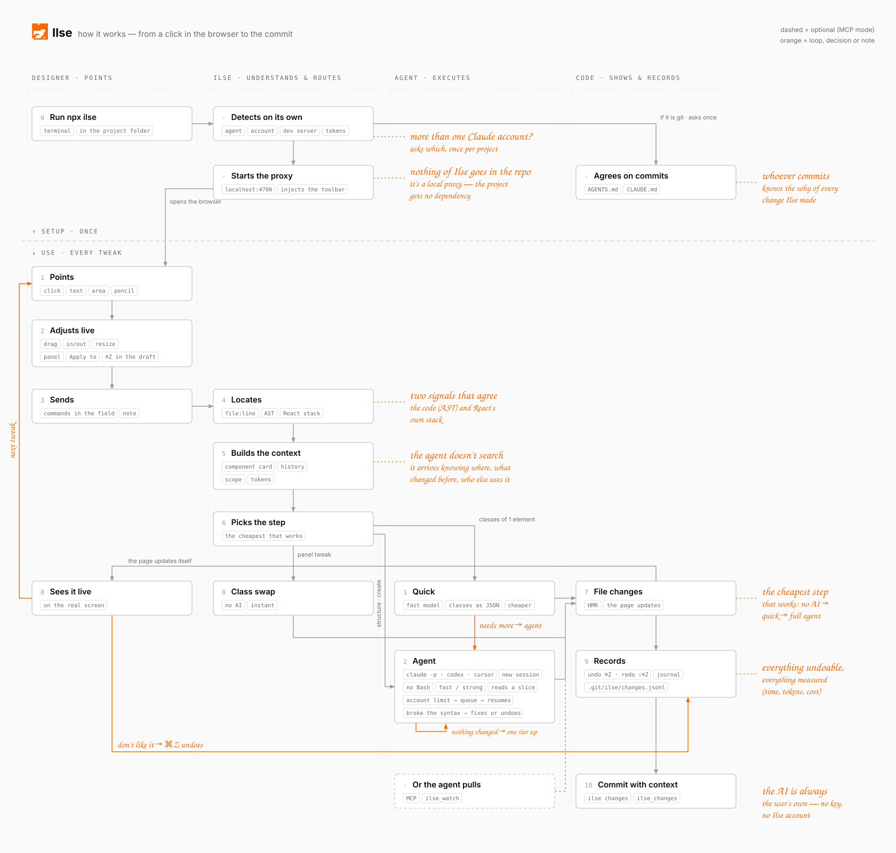

# How Ilse works

**English** · [Português](how-it-works.pt-BR.md) · [← README](../README.md)



<sub>Diagram source: `scripts/architecture-svg.py` (`python3 scripts/architecture-svg.py en` / `pt`).</sub>

1. Your dev server runs as usual. Ilse finds it and serves the same app at `localhost:4700`, with the toolbar injected. Hot reload keeps working; your project needs no import. With the [Vite plugin](reference.md#on-your-apps-own-port-vite-plugin), the dev server loads the toolbar itself; with the [bookmarklet or Chrome extension](reference.md#any-local-page-bookmarklet-or-chrome-extension), the browser does. Either way there is no proxy.
2. You point at something and send. Ilse resolves it to the exact place in your code and builds a short, precise request.
3. The cheapest step that can apply it does: Ilse itself, a fast model, or your full agent.
4. The file changes, the page updates, and the change is recorded so it can be undone and explained at commit time.

## Why the agent gets it right

Before your agent is called, Ilse does the searching for it:

- **Exact source location.** The clicked element is resolved to `file:line`, and the agent gets that code with the request. Two independent signals have to agree: the code itself (classes, text, attributes, parsed from the AST) and React's own dev stack (which component rendered it, in which file, used where). No bundler plugin.
- **Only the slice it needs.** The agent is told which lines to read, not the whole file — a 900-line component is ~10k tokens, re-sent on every turn.
- **Component card.** For a reused component: where it is defined, whether it takes a `className`, and where it is used.
- **Ilse's own history.** The last changes Ilse made to the same file ride along ("decided by the designer, keep them"), so a new fix doesn't undo an earlier one.
- **Your design tokens.** Read on startup from `tailwind.config`, Tailwind v4 `@theme`, CSS variables or W3C `tokens.json`, so the agent uses your token rather than a hardcoded value.
- **Only what matters.** Styles are filtered by intent: "wrong color" sends only color information.
- **Your references.** Pasted screenshots go along; dropped SVGs are copied into the project as assets.

## The cheapest step that works

1. **Class swap — no AI.** A panel edit that maps cleanly to a Tailwind class (gap 12px → 16px, weight 500 → 600, a color from your tokens), or retyped text written as plain text in the JSX, is changed by Ilse itself. Instant, no tokens.
2. **Quick — one call, fast model.** A note about one element that is really a class change ("a bit more space", "stronger title") goes to your agent's fast model with only that element's code and no tools. It answers "remove these classes, add those" and Ilse applies it. Much cheaper than the agent, and a few seconds. Notes that plainly need more ("remove", "swap the icon", "a carousel") skip straight to the agent.
3. **Agent.** Anything bigger — new UI, structure, several files — runs your agent on a model sized to the task. If a cheap run changes no file, it is retried once a tier up.

**Models.** Two tiers per agent, `fast` and `strong`; open-ended work keeps the agent's own default. Claude ships with `haiku` / `sonnet`. Set your own in `.ilserc.json`:

```json
{ "models": { "fast": "haiku", "strong": "sonnet" } }
{ "models": { "codex": { "fast": "…", "strong": "…" } } }
```

`ILSE_MODEL=<model>` forces one model for everything.

**This one or all of them.** When the element belongs to a component repeated on the page, the card asks: *only this one* (an override where it is used) or *all of them* (the component's definition). With *all*, the preview already shows the change on every instance.

## Keeping your project safe

- **The agent runs isolated.** No personal `CLAUDE.md` or memory — only the project's own instructions. No shell: it reads and edits files, nothing else.
- **The code is checked after the agent.** Since the agent can't build your project, Ilse parses every file it changed. If one no longer parses, the agent gets one turn to fix exactly that error; if it is still broken, the whole batch is undone and the card shows where.
- **Previews never touch React's DOM structure.** Drags and panel edits are shown with styles and stand-ins; cancelling a note puts the page back.

## Undo

⌘Z works at two levels:

- **While you adjust** (the card is open): ⌘Z steps back through that draft — a panel value, a drag, a resize — on screen only. It never reaches into files you already applied.
- **After it's applied:** ⌘Z (or **Undo** in the toolbar) restores the files of the latest change, newest first; ⇧⌘Z puts it back. No need to ask the AI to revert.

The shortcut doesn't take over while you type. Files you edited again afterwards are left alone, and the annotation goes back to pending so you can adjust and resend it.

## When your agent hits its usage limit

Ilse runs on your agent's account and shares its limits. For Claude, claude.ai, the Desktop app and Claude Code all count toward the same limit on the **same account**. If the Desktop app keeps working while Ilse is limited, they are on different accounts — see [Which Claude account](reference.md#which-claude-account-ilse-uses).

When the limit hits:

- **You see why:** the agent's own message ("You've hit your session limit · resets 7:30pm") and the account.
- **Nothing piles up failing:** Ilse stops calling the agent until the reset.
- **Annotations wait and resume on their own** shortly after the reset. (The queue lives in the running `ilse`; restart it before the reset and they go back to pending.)
- **Panel edits keep working** — class swaps don't use the agent.

To keep going before the reset: switch account (`--account`) or use the clipboard mode.

## Commits know what Ilse changed

Ilse's edits land through another process, so the session that later commits didn't make them. Ilse keeps a ledger in `.git/ilse/changes.jsonl` (per clone, never committed): for every batch, the designer's note, panel edits and files.

- `ilse changes` prints what Ilse changed that isn't committed yet, ready for the commit message (also the `ilse_changes` MCP tool).
- On the first run in a git repo, Ilse asks to add a short note to your `AGENTS.md` / `CLAUDE.md` telling your agent to include those changes.
