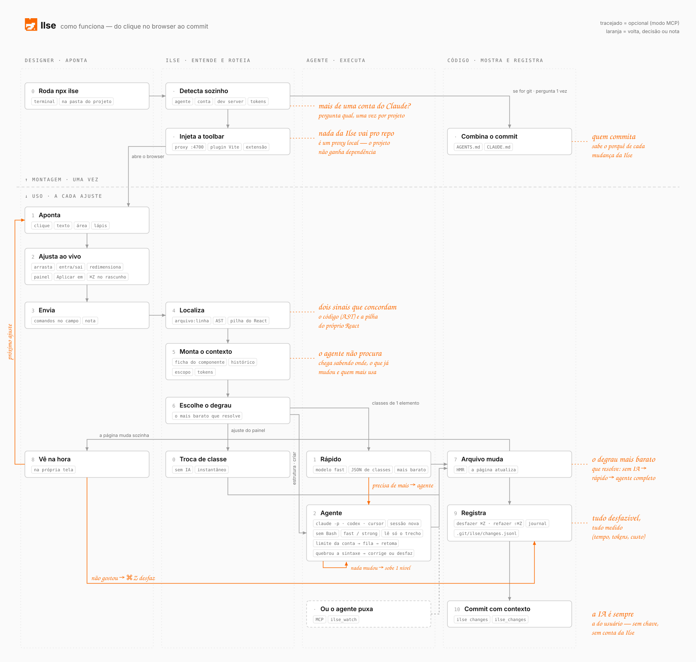

# Como a Ilse funciona

[English](how-it-works.md) · **Português** · [← README](../README.pt-BR.md)



<sub>Fonte do diagrama: `scripts/architecture-svg.py` (`python3 scripts/architecture-svg.py en` / `pt`).</sub>

1. Seu servidor de desenvolvimento roda como sempre. A Ilse o encontra e serve o mesmo app em `localhost:4700`, com a barra por cima. O hot reload continua funcionando; seu projeto não precisa de nenhum import.
2. Você aponta algo e envia. A Ilse localiza o lugar exato no seu código e monta um pedido curto e preciso.
3. O degrau mais barato que resolve aplica: a própria Ilse, um modelo rápido ou o seu agente completo.
4. O arquivo muda, a página atualiza, e a mudança fica registrada para poder ser desfeita e explicada na hora do commit.

## Por que o agente acerta

Antes de chamar o seu agente, a Ilse faz a busca por ele:

- **Localização exata no código.** O elemento clicado vira `arquivo:linha`, e o agente recebe esse trecho junto com o pedido. Dois sinais independentes precisam concordar: o próprio código (classes, texto, atributos, lidos da AST) e a pilha de desenvolvimento do React (qual componente renderizou, em que arquivo, usado onde). Sem plugin de bundler.
- **Só o trecho necessário.** O agente recebe quais linhas ler, não o arquivo inteiro — um componente de 900 linhas são ~10 mil tokens, reenviados a cada turno.
- **Ficha do componente.** Para um componente reutilizado: onde ele é definido, se aceita `className` e onde é usado.
- **O histórico da própria Ilse.** As últimas mudanças que a Ilse fez no mesmo arquivo vão junto ("decididas pelo designer, mantenha"), para uma correção nova não desfazer uma anterior.
- **Seus tokens de design.** Lidos ao iniciar, de `tailwind.config`, `@theme` do Tailwind v4, variáveis CSS ou `tokens.json` do W3C, para o agente usar o seu token em vez de um valor fixo.
- **Só o que importa.** Os estilos são filtrados pela intenção: "cor errada" manda só informação de cor.
- **Suas referências.** Prints colados vão junto; SVGs arrastados são copiados para o projeto como assets.

## O degrau mais barato que resolve

1. **Troca de classe — sem IA.** Uma edição do painel que vira uma classe do Tailwind sem ambiguidade (gap 12px → 16px, peso 500 → 600, uma cor dos seus tokens), ou um texto reescrito que está escrito direto no JSX, é aplicada pela própria Ilse. Na hora, sem tokens.
2. **Rápido — uma chamada, modelo rápido.** Uma nota sobre um elemento que na verdade é uma troca de classe ("um pouco mais de espaço", "título mais forte") vai para o modelo rápido do seu agente, só com o código daquele elemento e sem ferramentas. Ele responde "tire estas classes, ponha aquelas" e a Ilse aplica. Cerca de US$ 0,01 e alguns segundos. Notas que claramente pedem mais ("remover", "trocar o ícone", "um carrossel") vão direto para o agente.
3. **Agente.** Qualquer coisa maior — UI nova, estrutura, vários arquivos — roda o seu agente num modelo do tamanho da tarefa. Se uma execução barata não muda nenhum arquivo, ela é repetida uma vez, um nível acima.

**Modelos.** Dois níveis por agente, `fast` e `strong`; trabalho aberto fica com o padrão do próprio agente. O Claude vem com `haiku` / `sonnet`. Defina os seus em `.ilserc.json`:

```json
{ "models": { "fast": "haiku", "strong": "sonnet" } }
{ "models": { "codex": { "fast": "…", "strong": "…" } } }
```

`ILSE_MODEL=<modelo>` força um modelo para tudo.

**Só este ou todos.** Quando o elemento faz parte de um componente repetido na página, o card pergunta: *só este* (um ajuste onde ele é usado) ou *todos* (a definição do componente). Com *todos*, a prévia já mostra a mudança em todas as instâncias.

## Mantendo seu projeto seguro

- **O agente roda isolado.** Sem o seu `CLAUDE.md` pessoal nem memória — só as instruções do próprio projeto. Sem shell: ele lê e edita arquivos, mais nada.
- **O código é conferido depois do agente.** Como o agente não consegue fazer o build do projeto, a Ilse lê cada arquivo que ele mudou. Se algum deixou de compilar, o agente ganha um turno para corrigir exatamente aquele erro; se continuar quebrado, o lote inteiro é desfeito e o card mostra onde.
- **As prévias não mexem na estrutura do React.** Arrastes e edições do painel aparecem com estilos e substitutos; cancelar uma nota devolve a página como estava.

## Desfazer

O ⌘Z funciona em dois níveis:

- **Enquanto você ajusta** (o card está aberto): o ⌘Z volta passo a passo naquele rascunho — um valor do painel, um arraste, um redimensionamento — só na tela. Ele nunca mexe em arquivos que você já aplicou.
- **Depois de aplicado:** ⌘Z (ou **Desfazer** na barra) restaura os arquivos da última mudança, da mais nova para a mais antiga; ⇧⌘Z refaz. Não precisa pedir para a IA reverter.

O atalho não interfere enquanto você digita. Arquivos que você editou de novo depois ficam como estão, e a anotação volta para pendente, para você ajustar e reenviar.

## Quando o agente bate no limite de uso

A Ilse roda na conta do seu agente e divide os limites dela. No Claude, claude.ai, o app Desktop e o Claude Code contam para o mesmo limite **na mesma conta**. Se o Desktop continua funcionando enquanto a Ilse está limitada, são contas diferentes — veja [Qual conta do Claude](reference.pt-BR.md#qual-conta-do-claude-a-ilse-usa).

Quando o limite chega:

- **Você vê o motivo:** a mensagem do próprio agente ("You've hit your session limit · resets 7:30pm") e a conta.
- **Nada se acumula falhando:** a Ilse para de chamar o agente até o horário de renovação.
- **As anotações esperam e voltam sozinhas** logo depois da renovação. (A fila vive no `ilse` em execução; se você reiniciar antes, elas voltam para pendentes.)
- **Edições do painel continuam funcionando** — a troca de classe não usa o agente.

Para seguir antes da renovação: troque de conta (`--account`) ou use o modo área de transferência.

## Os commits sabem o que a Ilse mudou

As edições da Ilse chegam por outro processo, então a sessão que faz o commit depois não as fez. A Ilse mantém um registro em `.git/ilse/changes.jsonl` (por clone, nunca vai para o commit): para cada lote, a nota do designer, as edições do painel e os arquivos.

- `ilse changes` mostra o que a Ilse mudou e ainda não foi commitado, pronto para a mensagem de commit (também como a ferramenta MCP `ilse_changes`).
- Na primeira execução num repositório git, a Ilse pede para adicionar uma nota curta no seu `AGENTS.md` / `CLAUDE.md`, dizendo ao seu agente para incluir essas mudanças.
